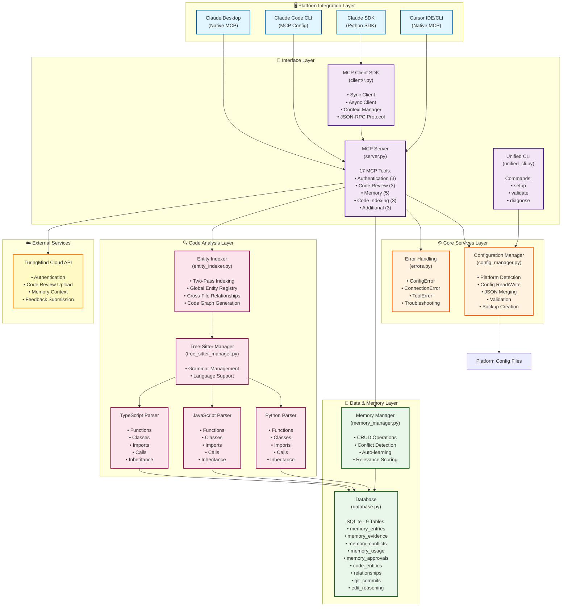
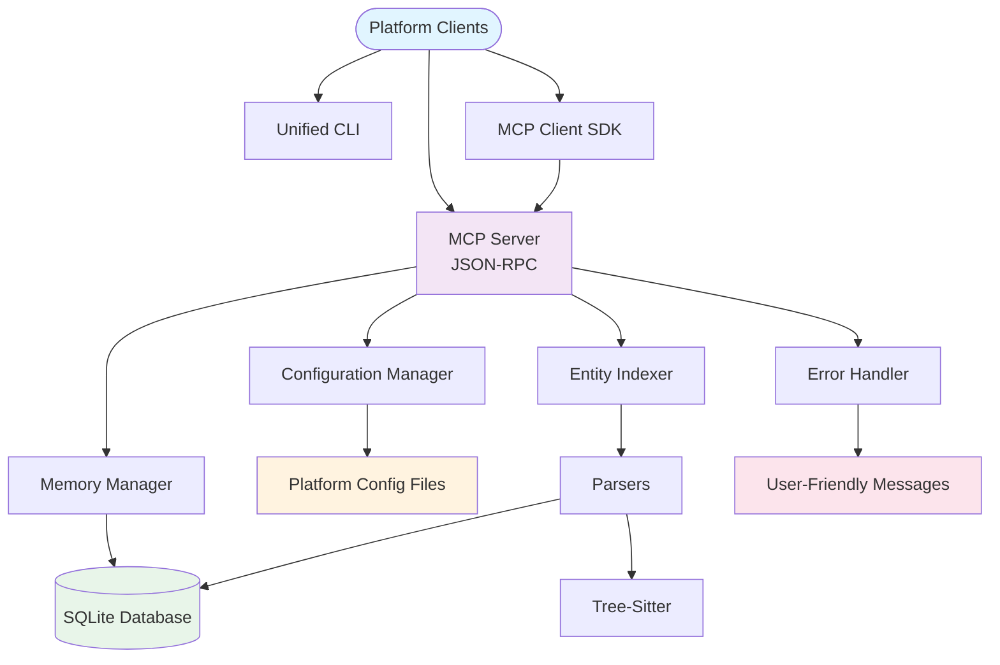
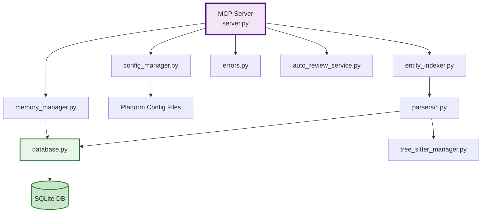
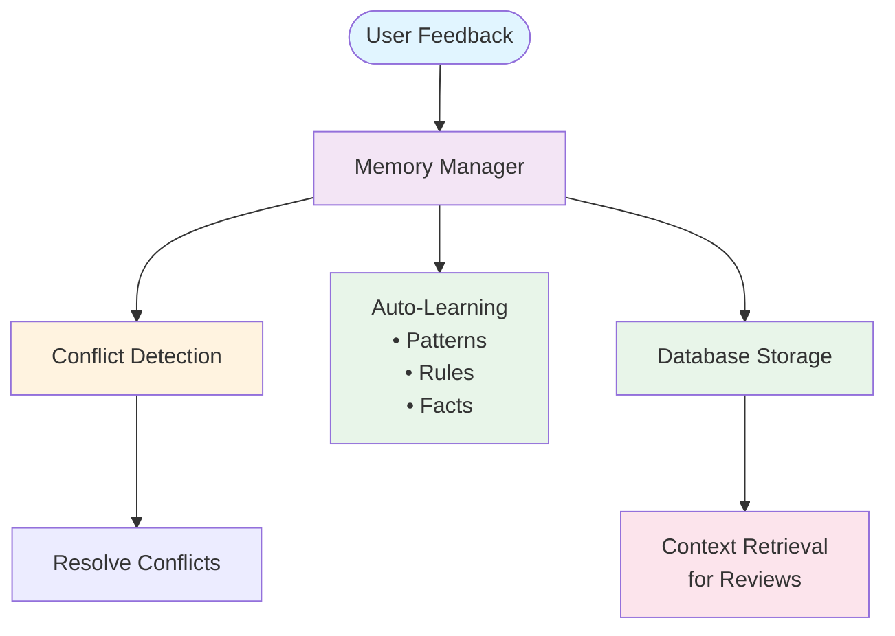

# TuringMind-MCP Architecture Diagram

## Component Architecture Overview

### Mermaid Diagram



### ASCII Diagram (Legacy)

```
╔═════════════════════════════════════════════════════════════════════════════╗
║                    PLATFORM INTEGRATION LAYER                               ║
╠═════════════════════════════════════════════════════════════════════════════╣
║                                                                             ║
║  ┌─────────────────┐  ┌─────────────────┐  ┌─────────────────┐  ┌───────┐ ║
║  │  Claude Desktop │  │  Claude Code    │  │   Claude SDK     │  │Cursor │ ║
║  │                 │  │     CLI          │  │                 │  │IDE/CLI│ ║
║  │  (Native MCP)   │  │  (MCP Config)   │  │  (Python SDK)   │  │(Native│ ║
║  └────────┬────────┘  └────────┬────────┘  └────────┬────────┘  │  MCP) │ ║
║           │                     │                     │          └───┬───┘ ║
╚═══════════╪═════════════════════╪═════════════════════╪══════════════╪═════╝
            │                     │                     │              │
            └─────────────────────┴─────────────────────┴──────────────┘
                                      │
                                      ▼
╔═════════════════════════════════════════════════════════════════════════════╗
║                         INTERFACE LAYER                                    ║
╠═════════════════════════════════════════════════════════════════════════════╣
║                                                                             ║
║  ┌───────────────────────────────────────────────────────────────────────┐ ║
║  │                      MCP Server (server.py)                           │ ║
║  │  ┌─────────────────────────────────────────────────────────────────┐   │ ║
║  │  │                    17 MCP Tools                               │   │ ║
║  │  │  ┌───────────────────────────────────────────────────────────┐ │   │ ║
║  │  │  │  Authentication (3)                                      │ │   │ ║
║  │  │  │    • initiate_login  • poll_login  • validate_auth       │ │   │ ║
║  │  │  └───────────────────────────────────────────────────────────┘ │   │ ║
║  │  │  ┌───────────────────────────────────────────────────────────┐ │   │ ║
║  │  │  │  Code Review (3)                                        │ │   │ ║
║  │  │  │    • upload_review  • get_context  • submit_feedback    │ │   │ ║
║  │  │  └───────────────────────────────────────────────────────────┘ │   │ ║
║  │  │  ┌───────────────────────────────────────────────────────────┐ │   │ ║
║  │  │  │  Memory Management (5)                                    │ │   │ ║
║  │  │  │    • list  • get  • create  • update  • delete          │ │   │ ║
║  │  │  └───────────────────────────────────────────────────────────┘ │   │ ║
║  │  │  ┌───────────────────────────────────────────────────────────┐ │   │ ║
║  │  │  │  Code Indexing (3)                                        │ │   │ ║
║  │  │  │    • index_codebase  • get_related_code  • get_structure  │ │   │ ║
║  │  │  └───────────────────────────────────────────────────────────┘ │   │ ║
║  │  │  ┌───────────────────────────────────────────────────────────┐ │   │ ║
║  │  │  │  Additional (3)                                           │ │   │ ║
║  │  │  │    • edit_reasoning  • store_reasoning  • auto_review     │ │   │ ║
║  │  │  └───────────────────────────────────────────────────────────┘ │   │ ║
║  │  └─────────────────────────────────────────────────────────────────┘   │ ║
║  └───────────────────────────────────────────────────────────────────────┘ ║
║                                                                             ║
║  ┌──────────────────────────────┐    ┌──────────────────────────────┐     ║
║  │      Unified CLI              │    │    MCP Client SDK            │     ║
║  │   (unified_cli.py)           │    │    (client/*.py)             │     ║
║  │                              │    │                              │     ║
║  │  Commands:                   │    │  Features:                   │     ║
║  │    • setup                   │    │    • Sync Client             │     ║
║  │    • validate                │    │    • Async Client            │     ║
║  │    • diagnose                │    │    • Context Manager          │     ║
║  │                              │    │    • JSON-RPC Protocol       │     ║
║  └──────────────────────────────┘    └──────────────────────────────┘     ║
║                                                                             ║
╚═════════════════════════════════════════════════════════════════════════════╝
                                      │
                                      ▼
╔═════════════════════════════════════════════════════════════════════════════╗
║                       CORE SERVICES LAYER                                  ║
╠═════════════════════════════════════════════════════════════════════════════╣
║                                                                             ║
║  ┌──────────────────────────────────┐    ┌──────────────────────────────┐  ║
║  │   Configuration Manager          │    │    Error Handling            │  ║
║  │   (config_manager.py)            │    │    (errors.py)               │  ║
║  │                                  │    │                              │  ║
║  │  Features:                       │    │  Exception Types:            │  ║
║  │    • Platform Detection          │    │    • ConfigError             │  ║
║  │    • Config Read/Write           │    │    • ConnectionError          │  ║
║  │    • Safe JSON Merging           │    │    • ToolError                │  ║
║  │    • Validation                  │    │    • Troubleshooting Guide   │  ║
║  │    • Backup Creation             │    │                              │  ║
║  └──────────────────────────────────┘    └──────────────────────────────┘  ║
║                                                                             ║
╚═════════════════════════════════════════════════════════════════════════════╝
                                      │
                                      ▼
╔═════════════════════════════════════════════════════════════════════════════╗
║                      DATA & MEMORY LAYER                                    ║
╠═════════════════════════════════════════════════════════════════════════════╣
║                                                                             ║
║  ┌───────────────────────────────────────────────────────────────────────┐ ║
║  │                  Memory Manager (memory_manager.py)                   │ ║
║  │                                                                       │ ║
║  │  Features:                                                            │ ║
║  │    • CRUD Operations                                                 │ ║
║  │    • Conflict Detection & Resolution                                 │ ║
║  │    • Auto-learning from Feedback                                     │ ║
║  │    • Relevance Scoring                                              │ ║
║  └───────────────────────────────────────────────────────────────────────┘ ║
║                                      │                                      ║
║                                      ▼                                      ║
║  ┌───────────────────────────────────────────────────────────────────────┐ ║
║  │                    Database (database.py)                              │ ║
║  │  ┌─────────────────────────────────────────────────────────────────┐ │ ║
║  │  │              SQLite Database Tables (9)                          │ │ ║
║  │  │                                                                 │ │ ║
║  │  │  Memory Tables:                                                  │ │ ║
║  │  │    • memory_entries      → Memory storage                       │ │ ║
║  │  │    • memory_evidence     → Evidence for memory                 │ │ ║
║  │  │    • memory_conflicts    → Conflict tracking                   │ │ ║
║  │  │    • memory_usage        → Usage statistics                    │ │ ║
║  │  │    • memory_approvals    → Approval tracking                   │ │ ║
║  │  │                                                                 │ │ ║
║  │  │  Code Tables:                                                   │ │ ║
║  │  │    • code_entities       → Functions, classes, files           │ │ ║
║  │  │    • relationships        → Code relationships                 │ │ ║
║  │  │    • git_commits         → Git commit tracking                 │ │ ║
║  │  │    • edit_reasoning      → Per-file edit reasoning            │ │ ║
║  │  └─────────────────────────────────────────────────────────────────┘ │ ║
║  └───────────────────────────────────────────────────────────────────────┘ ║
║                                                                             ║
╚═════════════════════════════════════════════════════════════════════════════╝
                                      │
                                      ▼
╔═════════════════════════════════════════════════════════════════════════════╗
║                      CODE ANALYSIS LAYER                                    ║
╠═════════════════════════════════════════════════════════════════════════════╣
║                                                                             ║
║  ┌───────────────────────────────────────────────────────────────────────┐ ║
║  │              Entity Indexer (entity_indexer.py)                        │ ║
║  │                                                                       │ ║
║  │  Features:                                                            │ ║
║  │    • Two-Pass Indexing (Registry + Relationship Resolution)         │ ║
║  │    • Global Entity Registry                                         │ ║
║  │    • Cross-File Relationship Detection                              │ ║
║  │    • Code Graph Generation                                           │ ║
║  └───────────────────────────────────────────────────────────────────────┘ ║
║                                      │                                      ║
║                                      ▼                                      ║
║  ┌───────────────────────────────────────────────────────────────────────┐ ║
║  │                        Parser Layer                                     │ ║
║  │                                                                       │ ║
║  │  ┌─────────────────────────────────────────────────────────────────┐ │ ║
║  │  │      Tree-Sitter Manager (tree_sitter_manager.py)               │ │ ║
║  │  │        • Grammar Management                                     │ │ ║
║  │  │        • Language Support: Python, JavaScript, TypeScript       │ │ ║
║  │  └─────────────────────────────────────────────────────────────────┘ │ ║
║  │                                                                       │ ║
║  │  ┌──────────────┐  ┌──────────────┐  ┌──────────────┐                │ ║
║  │  │   Python     │  │ JavaScript  │  │ TypeScript   │                │ ║
║  │  │   Parser     │  │   Parser    │  │   Parser     │                │ ║
║  │  │              │  │             │  │             │                │ ║
║  │  │ • Functions  │  │ • Functions │  │ • Functions │                │ ║
║  │  │ • Classes    │  │ • Classes   │  │ • Classes   │                │ ║
║  │  │ • Imports    │  │ • Imports   │  │ • Imports   │                │ ║
║  │  │ • Calls      │  │ • Calls     │  │ • Calls     │                │ ║
║  │  │ • Inheritance│  │ • Inheritance│ │ • Inheritance│                │ ║
║  │  └──────────────┘  └──────────────┘  └──────────────┘                │ ║
║  └───────────────────────────────────────────────────────────────────────┘ ║
║                                                                             ║
╚═════════════════════════════════════════════════════════════════════════════╝
                                      │
                                      ▼
╔═════════════════════════════════════════════════════════════════════════════╗
║                      EXTERNAL SERVICES                                      ║
╠═════════════════════════════════════════════════════════════════════════════╣
║                                                                             ║
║  ┌───────────────────────────────────────────────────────────────────────┐ ║
║  │              TuringMind Cloud API                                      │ ║
║  │                                                                       │ ║
║  │  Services:                                                            │ ║
║  │    • Authentication (Device Code Flow)                               │ ║
║  │    • Code Review Upload                                              │ ║
║  │    • Memory Context Retrieval                                         │ ║
║  │    • Feedback Submission                                             │ ║
║  └───────────────────────────────────────────────────────────────────────┘ ║
║                                                                             ║
╚═════════════════════════════════════════════════════════════════════════════╝
```

## Component Relationships

### Mermaid Data Flow Diagram



### Mermaid Dependency Graph



### ASCII Data Flow Diagram

```
┌─────────────────────────────────────────────────────────────────────────┐
│                        Platform Clients                                 │
│  (Claude Desktop, Claude CLI, Claude SDK, Cursor IDE/CLI)              │
└────────────────────────────┬────────────────────────────────────────────┘
                             │
                ┌────────────┼────────────┐
                │            │            │
                ▼            ▼            ▼
        ┌──────────────┐ ┌──────────┐ ┌──────────────┐
        │  MCP Server  │ │ Unified  │ │ MCP Client  │
        │  (JSON-RPC)  │ │   CLI    │ │     SDK     │
        └──────┬───────┘ └──────────┘ └──────┬──────┘
               │                              │
               │                              │
    ┌──────────┼──────────┬──────────┬───────┴──────────┐
    │          │          │          │                  │
    ▼          ▼          ▼          ▼                  ▼
┌─────────┐ ┌─────────┐ ┌─────────┐ ┌─────────┐ ┌──────────────┐
│ Config  │ │ Memory  │ │ Entity  │ │ Error   │ │ Auto Review │
│ Manager │ │ Manager │ │ Indexer │ │ Handler │ │  Service    │
└────┬────┘ └────┬────┘ └────┬────┘ └─────────┘ └──────────────┘
     │           │           │
     │           │           │
     ▼           ▼           ▼
┌─────────┐ ┌─────────┐ ┌─────────┐
│ Config  │ │Database  │ │ Parsers │
│ Files   │ │(SQLite)  │ │(Tree-   │
│         │ │          │ │ Sitter) │
└─────────┘ └─────────┘ └────┬────┘
                              │
                              ▼
                         ┌─────────┐
                         │Database │
                         │(Entities)│
                         └─────────┘
```

### Component Dependency Graph

```
                    ┌─────────────────────┐
                    │   MCP Server        │
                    │   (server.py)       │
                    └──────────┬──────────┘
                               │
        ┌──────────────────────┼──────────────────────┐
        │                      │                        │
        ▼                      ▼                        ▼
┌───────────────┐    ┌──────────────────┐    ┌──────────────────┐
│ Config Manager│    │  Memory Manager  │    │ Entity Indexer   │
│               │    │                  │    │                  │
│ • Platform    │    │ • CRUD Ops       │    │ • Two-Pass       │
│   Detection   │    │ • Conflicts       │    │ • Registry       │
│ • Validation  │    │ • Auto-learning   │    │ • Relationships │
└───────┬───────┘    └────────┬──────────┘    └────────┬─────────┘
        │                     │                        │
        ▼                     ▼                        ▼
┌───────────────┐    ┌──────────────────┐    ┌──────────────────┐
│ Config Files  │    │    Database      │    │     Parsers      │
│               │    │  (database.py)   │    │                  │
│ • claude_*    │    │                  │    │ • Python Parser  │
│ • cursor/*    │    │ • 9 Tables       │    │ • JS Parser      │
│ • mcp.json    │    │ • SQLite         │    │ • TS Parser      │
└───────────────┘    └──────────────────┘    └────────┬─────────┘
                                                       │
                                                       ▼
                                              ┌──────────────────┐
                                              │ Tree-Sitter      │
                                              │ Manager          │
                                              │                  │
                                              │ • Grammars       │
                                              │ • Languages      │
                                              └──────────────────┘
```

## Component Details

### 1. Platform Integration Layer
- **Claude Desktop**: Native MCP integration via config file
- **Claude Code CLI**: MCP config or Skills integration
- **Claude SDK**: Python client wrapper for programmatic access
- **Cursor IDE/CLI**: Native MCP integration via `.cursor/mcp.json`

### 2. Interface Layer
- **MCP Server**: Main server with 17 tools, handles JSON-RPC protocol
- **Unified CLI**: Single command interface (`turingmind setup/validate/diagnose`)
- **MCP Client SDK**: Synchronous and asynchronous clients for SDK usage

### 3. Core Services
- **Configuration Manager**: Multi-platform config management with validation
- **Error Handling**: Platform-specific error messages and troubleshooting

### 4. Data & Memory Layer
- **Memory Manager**: High-level memory operations, conflict resolution
- **Database**: SQLite database with 9 tables for memory, entities, relationships

### 5. Code Analysis Layer
- **Entity Indexer**: Two-pass indexing with global entity registry
- **Parsers**: Language-specific AST parsers (Python, JavaScript, TypeScript)
- **Tree-Sitter Manager**: Grammar management for AST parsing

### 6. External Services
- **TuringMind Cloud API**: Authentication, review upload, context retrieval

## Key Features

### Mermaid: Cross-File Relationship Detection Flow

```mermaid
flowchart TD
    Start([Entity Indexer]) --> FirstPass[First Pass:<br/>Build Global Entity Registry]
    Start --> SecondPass[Second Pass:<br/>Resolve Relationships]
    
    FirstPass --> Registry[(name, type) → entities]
    
    SecondPass --> FunctionCalls[Function Calls<br/>calls]
    SecondPass --> Imports[Imports<br/>IMPORTS]
    SecondPass --> Inheritance[Inheritance<br/>EXTENDS_CLASS]
    
    Registry --> SecondPass
    
    style Start fill:#f3e5f5
    style FirstPass fill:#e1f5ff
    style SecondPass fill:#e1f5ff
    style Registry fill:#e8f5e9
    style FunctionCalls,Imports,Inheritance fill:#fff3e0
```

### Mermaid: Memory Management Flow



### ASCII: Cross-File Relationship Detection Flow

```
┌─────────────────────────────────────────────────────────────────┐
│                    Entity Indexer                              │
│                  (Two-Pass Process)                             │
└───────────────────────────┬─────────────────────────────────────┘
                            │
        ┌───────────────────┴───────────────────┐
        │                                       │
        ▼                                       ▼
┌───────────────────┐              ┌──────────────────────┐
│   First Pass      │              │   Second Pass         │
│                   │              │                       │
│ Build Global      │              │ Resolve Relationships │
│ Entity Registry   │              │                       │
│                   │              │                       │
│ (name, type) ───►│              │ • Function Calls      │
│   [entities]      │              │   (calls)             │
└───────────────────┘              │ • Imports             │
                                    │   (IMPORTS)           │
                                    │ • Inheritance         │
                                    │   (EXTENDS_CLASS)     │
                                    └──────────────────────┘
```

### Memory Management Flow

```
┌─────────────────────────────────────────────────────────────────┐
│                      User Feedback                                │
└───────────────────────────┬─────────────────────────────────────┘
                            │
                            ▼
                ┌───────────────────────┐
                │   Memory Manager        │
                └───────────┬─────────────┘
                            │
        ┌───────────────────┼───────────────────┐
        │                   │                     │
        ▼                   ▼                     ▼
┌──────────────┐  ┌──────────────┐      ┌─────────────────┐
│   Conflict   │  │ Auto-Learning│      │  Database       │
│  Detection   │  │              │      │  Storage        │
│              │  │ • Patterns   │      │                 │
│ • Compare    │  │ • Rules      │      │ • Persistence    │
│ • Resolve    │  │ • Facts      │      │ • Query         │
└──────────────┘  └──────────────┘      └────────┬────────┘
                                                  │
                                                  ▼
                                         ┌─────────────────┐
                                         │ Context          │
                                         │ Retrieval        │
                                         │ (for Reviews)    │
                                         └─────────────────┘
```

## Statistics

- **Total Components**: 15+ core modules
- **MCP Tools**: 17 tools
- **Platforms Supported**: 5 (Claude Desktop, Claude CLI, Claude SDK, Cursor IDE, Cursor CLI)
- **Languages Parsed**: 3 (Python, JavaScript, TypeScript)
- **Database Tables**: 9 tables
- **Test Coverage**: 44 test cases
